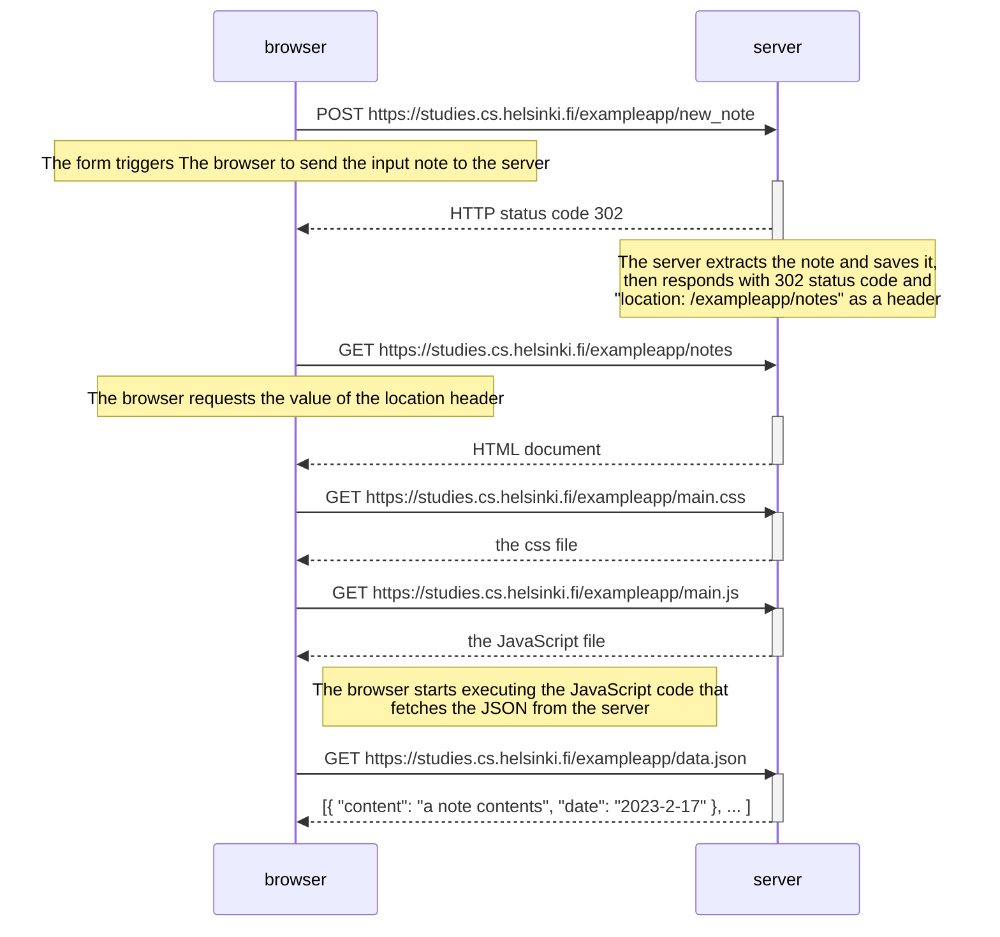
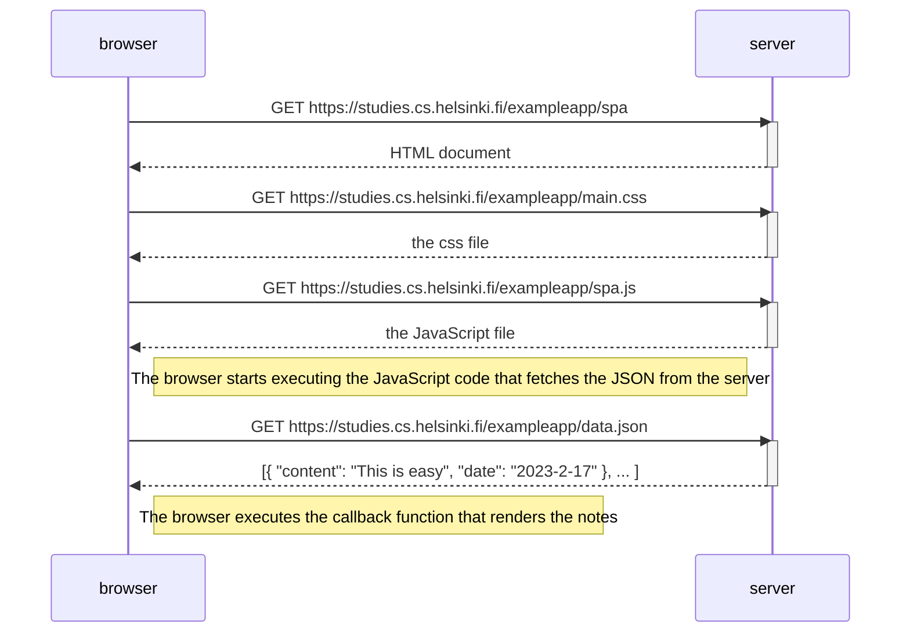
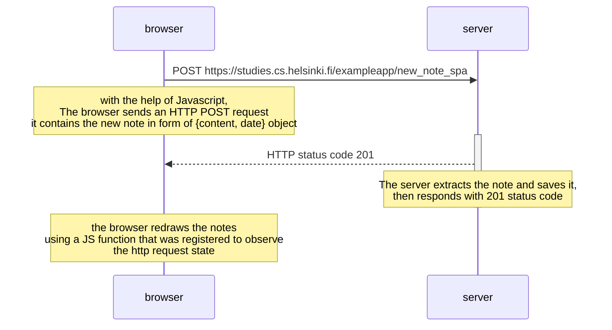

# 0.4: New note diagram
Here is what happens when a user creates a new note on the page https://studies.cs.helsinki.fi/exampleapp/notes 

# 0.5: Single page app diagram

# 0.6: New note in Single page app diagram
